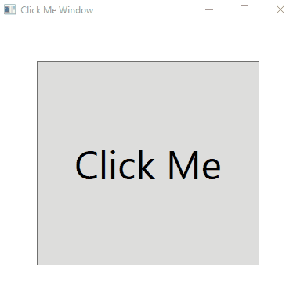

# Windows_Presetation_Foundation_2nd-Sol
Triggers, ToolTip and simple calculator

Task 1 ==>  Click button with interaction motions

Task 2 ==> Button with image toolTip

Task 3 ==> Simple Calculator

